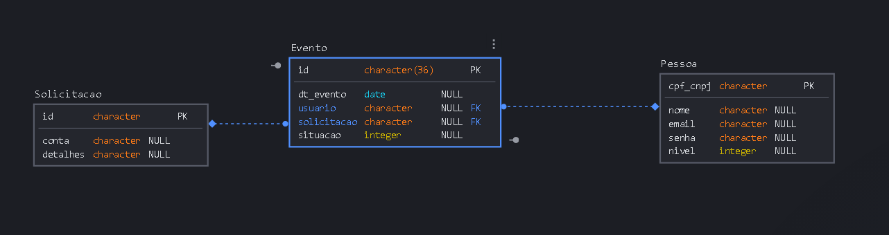
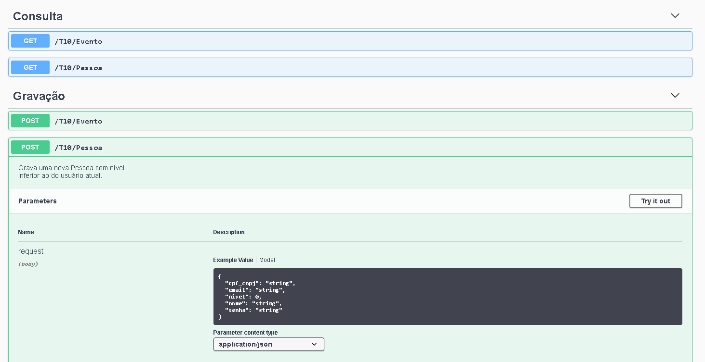
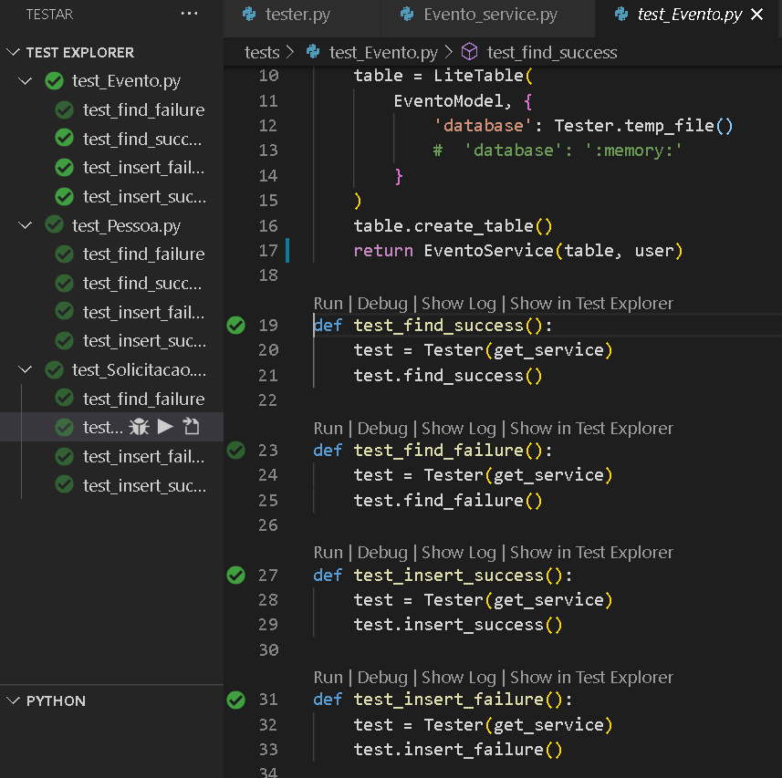
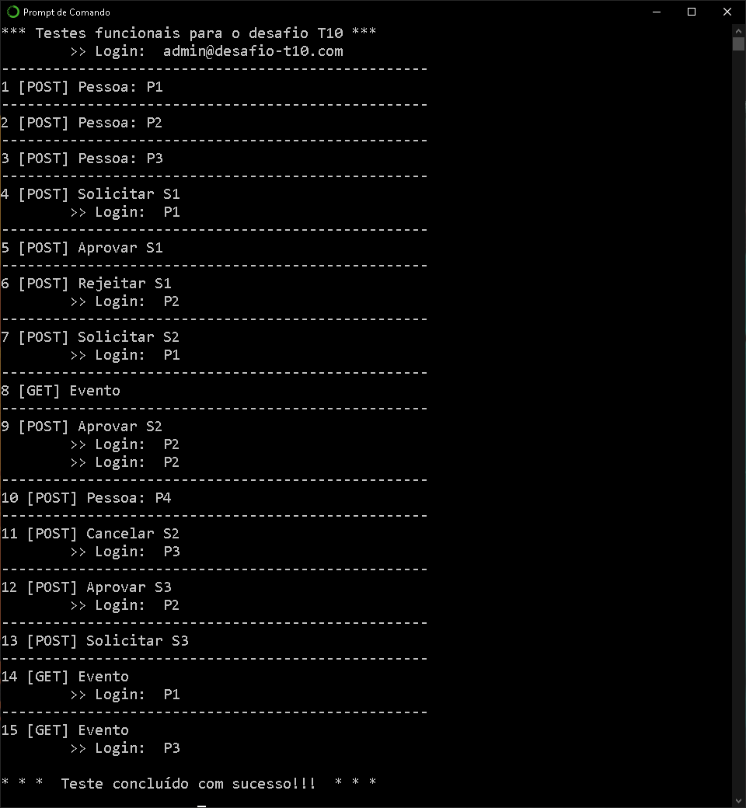

# Desafio T10

#####  por: `Júlio Cascalles`

```
Este projeto demonstra funções básicas de uma API para acompanhamento de solicitações de produtos.
```

---

### Banco de dados
* Esta API foi feita para rodar com Postgres (e os testes unitários com Sqlite)
    - Se quiser mudar de Postgres para MongoDb, abra o arquivo `/backend/service/db_connection.py` e troque o DAO SqlTable para MongoTable.
* Variáveis de ambiente (para usar com Postgres)
    - T10_USER
    - T10_HOST
    - T10_PASSWORD
    - T10_DATA_BASE
* Tabelas


---
### Bibliotecas de terceiros
* Todos os DAO´s foram **feitos por mim**!
* Marshmallow para modelagem;
* Flask restful para as rotas;
* SQLAlchemy;
* Faker para dados de testes.

---
### Como rodar:
    * Execute os scripts da pasta SQL no banco "T10" do seu servidor
    * Configure as variáveis de ambiente no seu sistema operacional -- Exemplo:
        - `SET T10_USER=root`
        - `SET T10_HOST=localhost`
        - `SET T10_PASSWORD=xyz1234`
        - `SET T10_DATA_BASE=julio`
    * Instale as dependências necessárias do Python, com...
        - `pip install -r requirements.txt`
    * Rode o back-end com...
        - `python app.py`

> Se você estiver usando Windows, disponibilizei o arquivo de lote `RUN.bat` para rodar a API.

---

### Rotas
* `/docs` Traz a documentação _Swagger_ com todos os verbos REST disponíveis para a API e exemplos funcionais 


* `/T10/Pessoa` Pode ser usado para trazer várias pessoas (onde você pode passar uma query com os nomes dos campos, p.ex.: `...?nome=PESSOAxyz`)

* `/T10/Evento` Permite gravar ou consultar um evento, de acordo com as permissões do usuário.

---

### Testes unitários
As seguintes situações foram testadas para verificar se cada serviço está funcionando conforme esperado:


* Falha na busca: Deve retornar o status 404 quando não encontra o registro
* Sucesso na busca: Retorna o registro relacionado ao campo chave usado na busca;
* Falha de inclusão: Não permite registro com campos inválidos;
* Sucesso na inclusão: Simula a gravação de um registro e retorna sem erros;




---

### Testes funcionais
Com a API rodando, o roteiro abaixo é executado, usando-se o comando `python simulador.py` :



#### **Roteiro de testes:**

1) Admin cria a pessoa 1 (P1)
2) ...cria a pessoa 2 (P2) com nível para rejeitar
3) ...cria a pessoa 3 (P3) com nível para cancelar
4) P1 faz a solicitação 1 (S1)
5) P1 tenta aprovar S1, mas deve falhar;
6) P2 rejeita S1
7) P1 faz nova solicitação (S2)
8) P1 consulta seus eventos -- Deve retornar S1 e S2
9) P2 aprova S2
10) P2 tenta criar uma pessoa com nível 4, mas vai falhar (porque é um nível acima do de P2)
11) P3 cancela S2
12) P2 tenta aprovar S3 (que não existe) então falha.
13) P2 cria a solicitação S3
14) Repete o passo 8 e a resposta deve ser a mesma.
15) P3 consulta todos os eventos -- Deve retornar S1, S2 e S3
